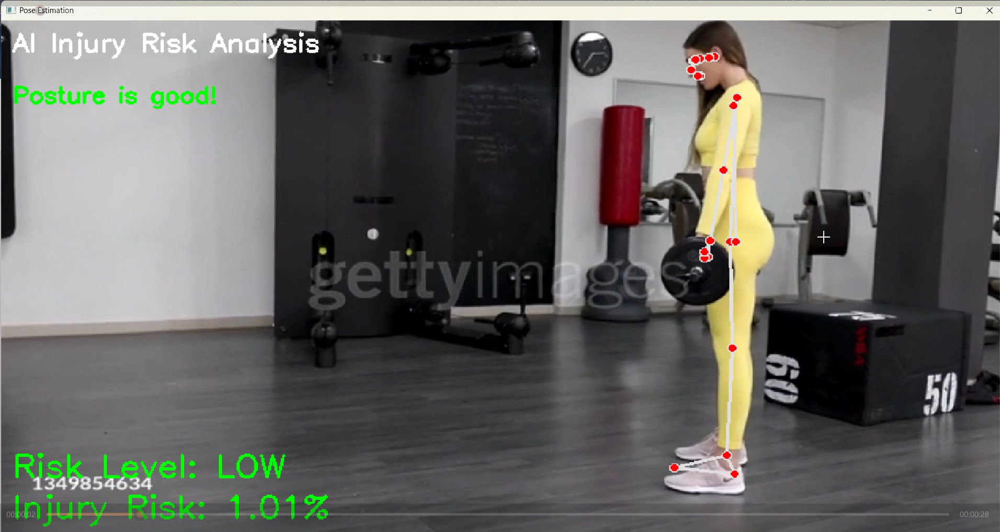
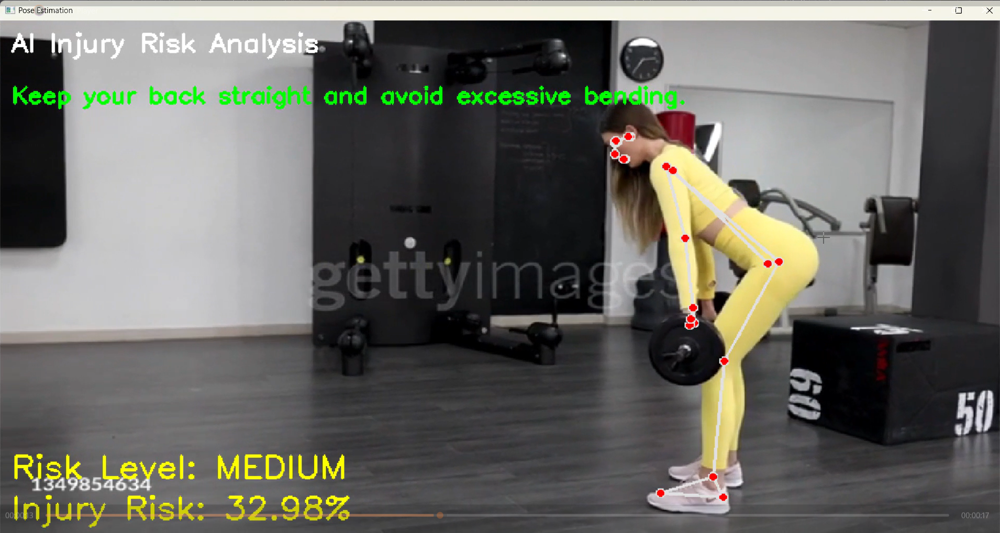
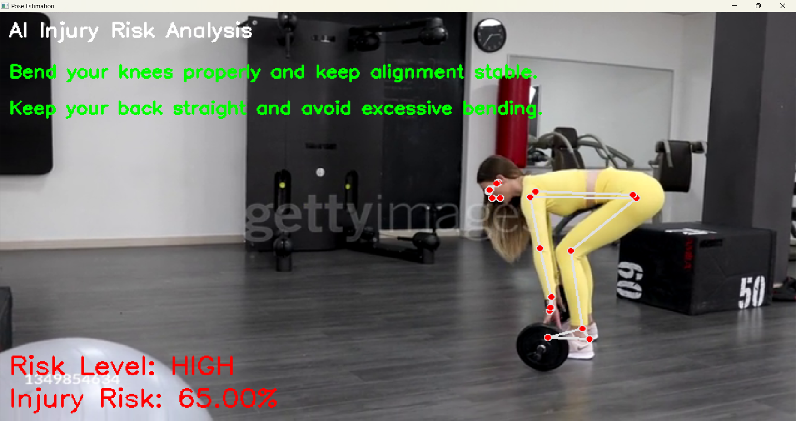

# Real-Time Injury Risk Detection Using Pose Estimation

## Overview

This project focuses on detecting injury risk in real-time using human pose estimation.
Initially, multiple machine learning models were trained to predict injury risk, but due to weak feature relationships in the dataset, their performance was limited.

To overcome this, a **biomechanical rule-based system using pose estimation** was implemented, providing more reliable and interpretable results.

---
## Output Screenshots

### 🟢 Low Risk


### 🟡 Medium Risk


### 🔴 High Risk

## Demo Video

demo.mp4


---

## Objectives

* Analyze sports injury dataset using machine learning
* Identify limitations of predictive modeling
* Develop a real-time injury detection system using pose estimation
* Provide live feedback on posture and injury risk

---

## Dataset

* Source: Sports injury dataset (Excel)
* Total records: 9600
* Features include:

  * Age, Height, Weight
  * Injury Type, Severity
  * Knee Angle, Speed, Jump Height
  * Reaction Time, Rehabilitation data

---

## Exploratory Data Analysis (EDA)

### Key Findings:

* Most features show **very weak correlation** with injury recurrence
* Significant overlap between classes
* Lower body injuries dominate the dataset
* No strong predictive patterns found

👉 **Conclusion:**
Traditional ML models struggle due to lack of meaningful feature relationships.

---

## Machine Learning Models Used

* Random Forest
* Decision Tree
* Logistic Regression
* Naive Bayes
* Gradient Boosting

### Performance Summary

| Model               | Accuracy |
| ------------------- | -------- |
| Decision Tree       | ~61%     |
| Random Forest       | ~56%     |
| Gradient Boosting   | ~54%     |
| Logistic Regression | ~50%     |
| Naive Bayes         | ~49%     |

Models performed close to random guessing.

---

##  Why ML Model Was Not Used in Final System

* Weak correlation between features and target
* High overlap between classes
* Low accuracy (~50–60%)
* Poor generalization

Using such models in real-time could produce unreliable and unsafe predictions.

---

## Final Approach: Pose Estimation

Instead of ML prediction, the system uses:

* MediaPipe Pose Estimation
* Joint position analysis
* Biomechanical rules

### Advantages

* Real-time analysis
* Based on actual human movement
* Interpretable feedback
* More reliable for injury prevention

---

## Features

* Real-time posture detection
* Joint alignment analysis
* Injury risk scoring
* Visual feedback overlay
* Risk classification (LOW / MEDIUM / HIGH)

---

## How It Works

1. Capture video input
2. Detect body landmarks using MediaPipe
3. Analyze joint alignment (knees, hips, back)
4. Apply rule-based biomechanical checks
5. Compute severity score
6. Convert to injury risk percentage
7. Display feedback on screen

---

## 📁 Project Structure

```
Injury Risk Detection/
│── injury_risk_detection.ipynb
│── Sports_data.xlsx
│── samplevideo.mp4
│── demo.mp4
│── README.md
│── requirements.txt
```

---

## Installation

```bash
git clone https://github.com/your-username/injury-risk-detection.git
cd injury-risk-detection
pip install -r requirements.txt
```

---

## Run the Project

```bash
jupyter notebook
```

Open:

```
injury_risk_detection.ipynb
```

---

## Future Improvements

* Use real-world motion capture datasets
* Incorporate time-series analysis
* Apply deep learning on video sequences
* Combine ML with pose-based features
* Integrate wearable sensor data

---

## Conclusion

This project demonstrates that:

> **Choosing the right approach based on data is more important than forcing complex models.**

A pose-based system provided more reliable and interpretable results compared to weak ML predictions.

---

## 👩‍💻 Author

**Fathima Sameera T M**


---
